# System Design Document
## Academic Management Platform

### Table of Contents
1. [Overview](#overview)
2. [Architecture](#architecture)
3. [System Components](#system-components)
4. [Database Design](#database-design)
5. [API Design](#api-design)
6. [Authentication & Authorization](#authentication--authorization)
7. [File Management](#file-management)
8. [AI Integration](#ai-integration)
9. [Real-time Features](#real-time-features)
10. [Deployment Architecture](#deployment-architecture)
11. [Security Considerations](#security-considerations)
12. [Performance & Scalability](#performance--scalability)

---

## Overview

The Academic Management Platform is a full-stack university CRM system designed to manage the complete academic lifecycle including user management, course administration, assignment workflows, and AI-powered features. The system follows a modular monolithic architecture with clear separation of concerns.

### Key Requirements
- Role-based access control (Student, Lecturer, Admin)
- Course lifecycle management
- Assignment submission and grading workflow
- AI-powered course recommendations and syllabus generation
- Real-time notifications
- File upload and management
- Scalable and maintainable codebase

---

## Architecture

### High-Level Architecture Diagram

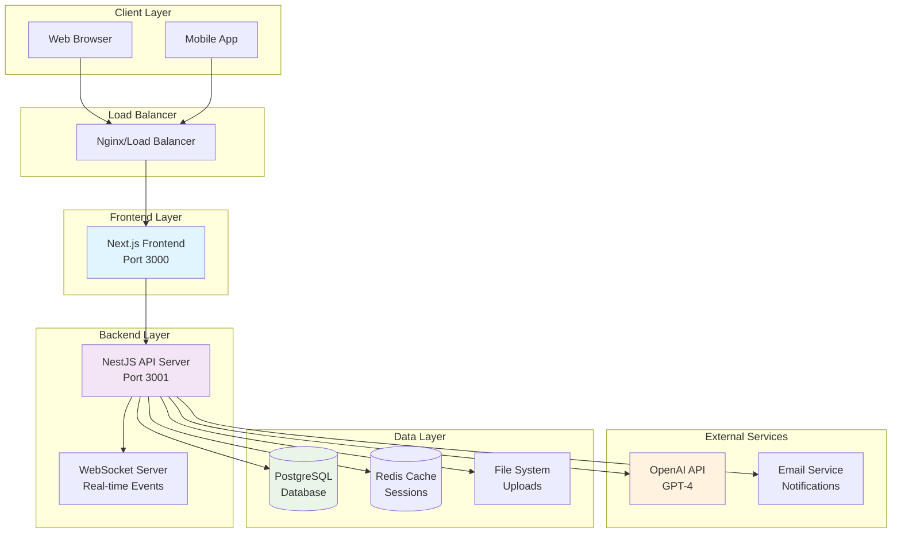

### Architecture Pattern: Modular Monolith

The system follows a **Modular Monolith** pattern with the following benefits:
- **Simplified Deployment**: Single deployable unit
- **Consistent Data**: ACID transactions across modules
- **Development Speed**: Faster development and testing
- **Clear Boundaries**: Well-defined module interfaces
- **Future Migration**: Easy to extract microservices later

---

## System Components

### Frontend Architecture (Next.js)

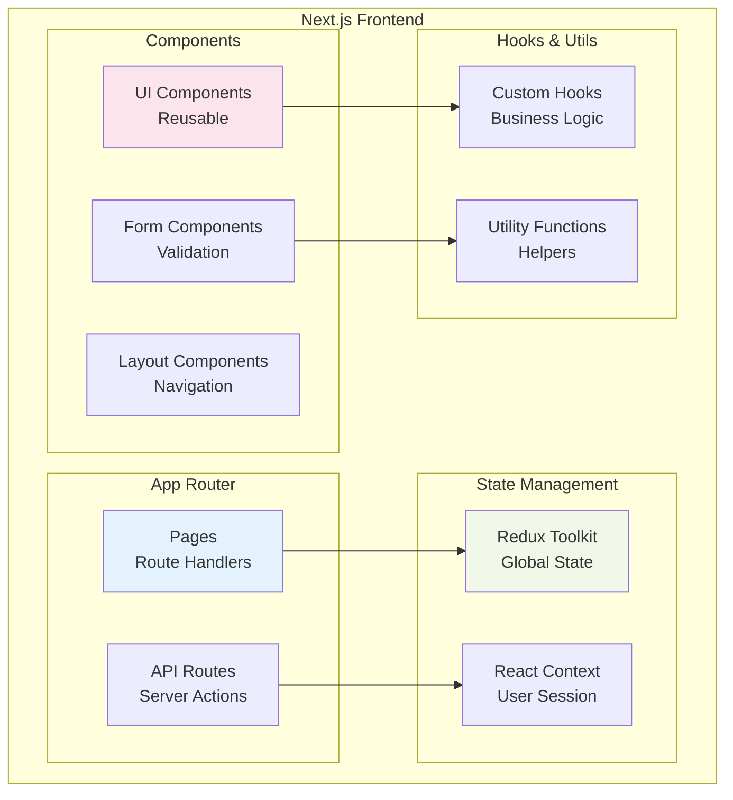

### Backend Architecture (NestJS)

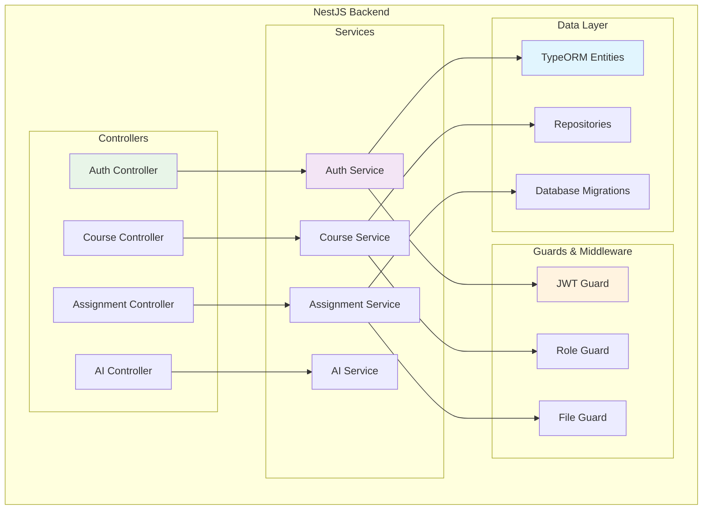

---

## Database Design

### Entity Relationship Diagram

```mermaid
erDiagram
    USER {
        uuid id PK
        string email UK
        string password
        string firstName
        string lastName
        enum role
        timestamp createdAt
        timestamp updatedAt
    }
    
    COURSE {
        uuid id PK
        string title
        string description
        int credits
        uuid lecturerId FK
        string syllabusPath
        timestamp createdAt
        timestamp updatedAt
    }
    
    ENROLLMENT {
        uuid id PK
        uuid courseId FK
        uuid studentId FK
        enum status
        timestamp enrolledAt
        timestamp approvedAt
    }
    
    ASSIGNMENT {
        uuid id PK
        uuid courseId FK
        uuid studentId FK
        string title
        text description
        string filePath
        float grade
        timestamp submittedAt
        timestamp gradedAt
    }
    
    NOTIFICATION {
        uuid id PK
        uuid userId FK
        string type
        string title
        text message
        boolean isRead
        timestamp createdAt
    }
    
    USER ||--o{ COURSE : "teaches"
    USER ||--o{ ENROLLMENT : "enrolls"
    USER ||--o{ ASSIGNMENT : "submits"
    USER ||--o{ NOTIFICATION : "receives"
    COURSE ||--o{ ENROLLMENT : "has"
    COURSE ||--o{ ASSIGNMENT : "contains"
    
    USER {
        STUDENT "Can enroll in courses"
        LECTURER "Can create courses"
        ADMIN "Can manage all"
    }
    
    ENROLLMENT {
        PENDING "Awaiting approval"
        APPROVED "Active enrollment"
        REJECTED "Denied enrollment"
        DROPPED "Student withdrew"
    }
```

### Database Schema Details

#### User Table
```sql
CREATE TABLE users (
    id UUID PRIMARY KEY DEFAULT gen_random_uuid(),
    email VARCHAR(255) UNIQUE NOT NULL,
    password VARCHAR(255) NOT NULL,
    first_name VARCHAR(100) NOT NULL,
    last_name VARCHAR(100) NOT NULL,
    role user_role NOT NULL DEFAULT 'STUDENT',
    created_at TIMESTAMP DEFAULT CURRENT_TIMESTAMP,
    updated_at TIMESTAMP DEFAULT CURRENT_TIMESTAMP
);

CREATE TYPE user_role AS ENUM ('STUDENT', 'LECTURER', 'ADMIN');
```

#### Course Table
```sql
CREATE TABLE courses (
    id UUID PRIMARY KEY DEFAULT gen_random_uuid(),
    title VARCHAR(255) NOT NULL,
    description TEXT,
    credits INTEGER NOT NULL DEFAULT 3,
    lecturer_id UUID REFERENCES users(id),
    syllabus_path VARCHAR(500),
    created_at TIMESTAMP DEFAULT CURRENT_TIMESTAMP,
    updated_at TIMESTAMP DEFAULT CURRENT_TIMESTAMP
);
```

---

## API Design

### RESTful API Structure

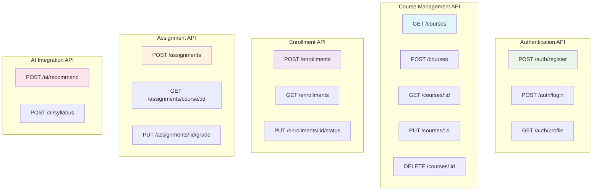

### API Response Format

```typescript
// Success Response
interface APIResponse<T> {
    success: true;
    data: T;
    message?: string;
    timestamp: string;
}

// Error Response
interface APIError {
    success: false;
    error: {
        code: string;
        message: string;
        details?: any;
    };
    timestamp: string;
}

// Paginated Response
interface PaginatedResponse<T> {
    success: true;
    data: T[];
    pagination: {
        page: number;
        limit: number;
        total: number;
        totalPages: number;
    };
}
```

---

## Authentication & Authorization

### JWT Authentication Flow

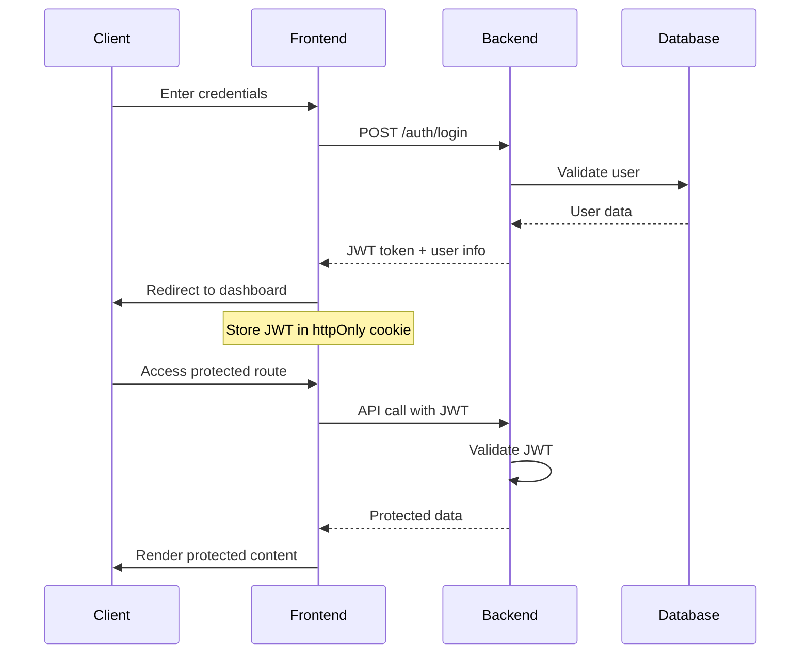

### Role-Based Access Control (RBAC)

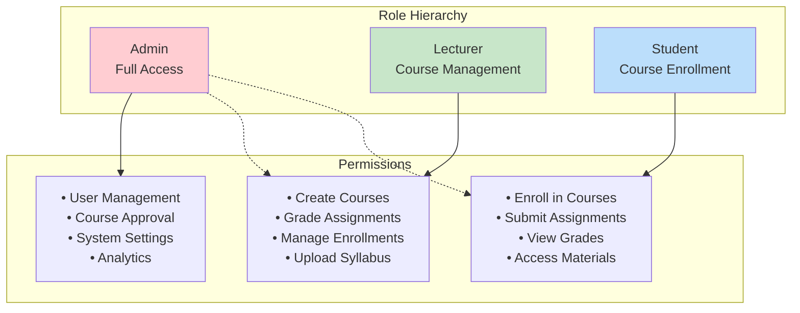

---

## File Management

### File Upload Architecture

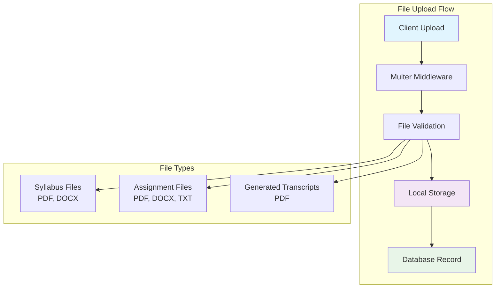

### File Storage Structure

```
uploads/
├── syllabi/
│   ├── {courseId}/
│   │   └── {timestamp}-{filename}
├── assignments/
│   ├── {courseId}/
│   │   ├── {studentId}/
│   │   │   └── {assignmentId}-{filename}
└── transcripts/
    ├── {studentId}/
    │   └── {timestamp}-transcript.pdf
```

---

## AI Integration

### AI Service Architecture

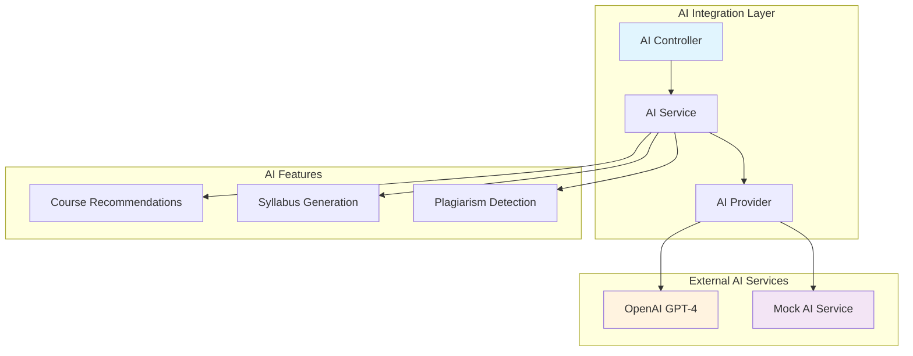

### AI Workflow Examples

#### Course Recommendation Flow
```typescript
interface RecommendationRequest {
    studentId: string;
    interests: string[];
    completedCourses: string[];
}

interface RecommendationResponse {
    courses: {
        id: string;
        title: string;
        description: string;
        matchScore: number;
        reasons: string[];
    }[];
}
```

#### Syllabus Generation Flow
```typescript
interface SyllabusRequest {
    courseTitle: string;
    description: string;
    credits: number;
    duration: string;
}

interface SyllabusResponse {
    syllabus: {
        overview: string;
        objectives: string[];
        schedule: WeeklySchedule[];
        assessments: Assessment[];
        resources: Resource[];
    };
}
```

---

## Real-time Features

### WebSocket Architecture

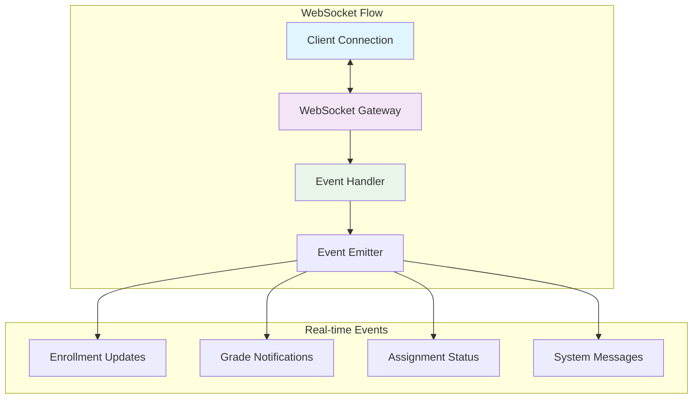

### Event Types

```typescript
enum SocketEvents {
    ENROLLMENT_APPROVED = 'enrollment.approved',
    ENROLLMENT_REJECTED = 'enrollment.rejected',
    ASSIGNMENT_GRADED = 'assignment.graded',
    COURSE_UPDATED = 'course.updated',
    SYSTEM_NOTIFICATION = 'system.notification'
}

interface SocketPayload {
    userId: string;
    event: SocketEvents;
    data: any;
    timestamp: string;
}
```

---

## Deployment Architecture

### Docker Container Architecture

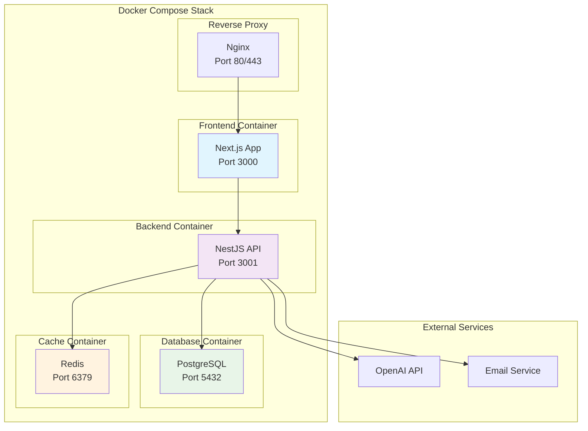

### Production Deployment Options

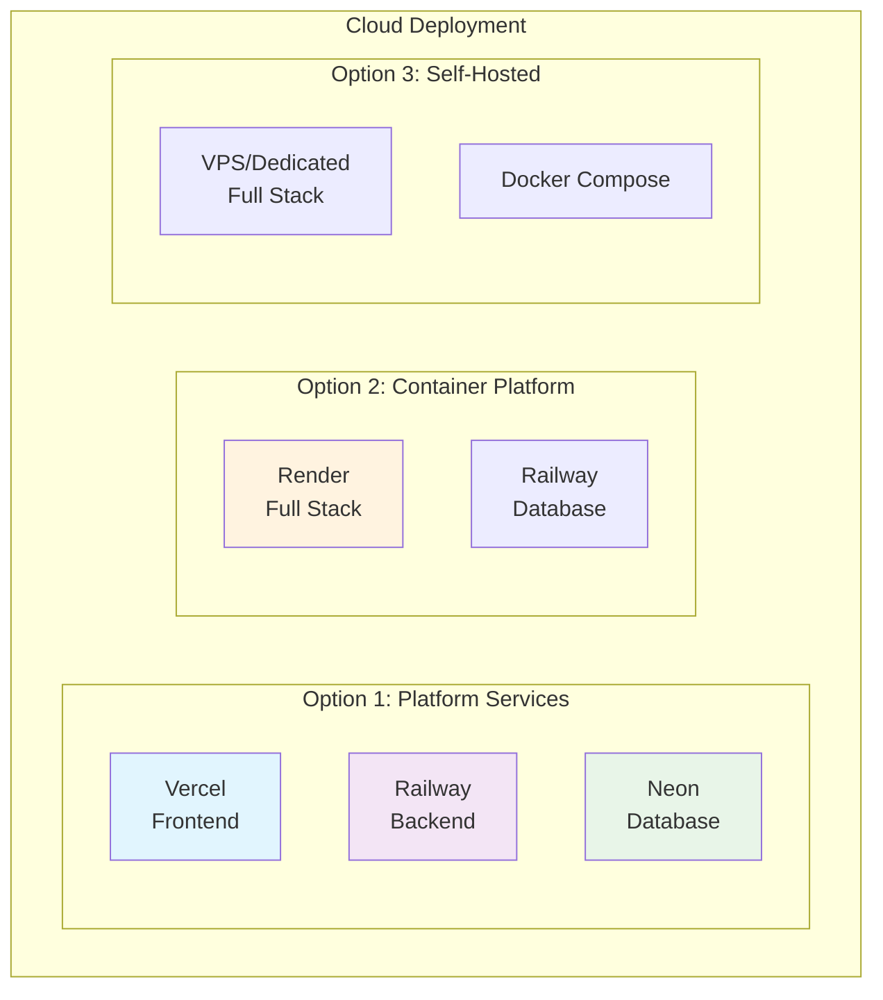

---

## Security Considerations

### Security Layers

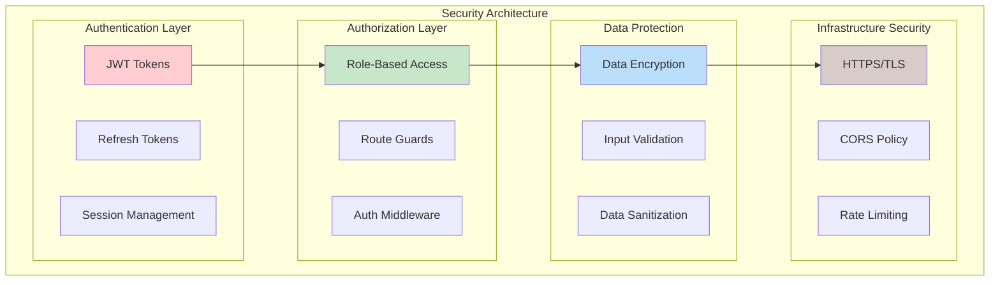

### Security Measures

1. **Authentication Security**
   - JWT tokens with short expiration
   - Refresh token rotation
   - Secure cookie storage
   - Password hashing with bcrypt

2. **Authorization Security**
   - Role-based access control
   - Route-level guards
   - Resource-level permissions
   - API endpoint protection

3. **Data Security**
   - Input validation and sanitization
   - SQL injection prevention
   - XSS protection
   - File upload validation

4. **Infrastructure Security**
   - HTTPS enforcement
   - CORS configuration
   - Rate limiting
   - Environment variable protection

---

## Performance & Scalability

### Performance Optimization

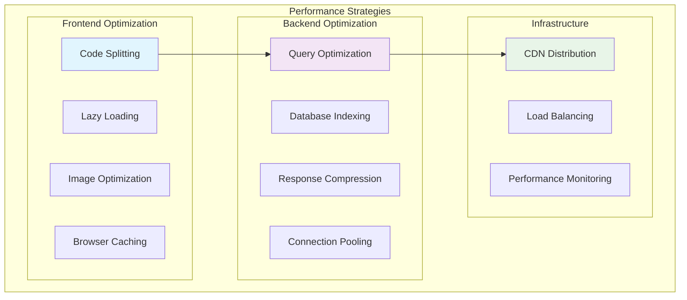

### Scalability Considerations

1. **Horizontal Scaling**
   - Stateless application design
   - Load balancer configuration
   - Database clustering
   - Microservices migration path

2. **Vertical Scaling**
   - Resource optimization
   - Memory management
   - CPU utilization
   - Database tuning

3. **Caching Strategy**
   - Redis for session storage
   - Database query caching
   - Static asset caching
   - API response caching

4. **Monitoring & Observability**
   - Application metrics
   - Database performance
   - Error tracking
   - User analytics

---

## Conclusion

This system design provides a robust, scalable, and maintainable architecture for the Academic Management Platform. The modular monolith approach ensures rapid development while maintaining the flexibility to evolve into microservices as the system grows.

### Key Design Decisions

1. **Modular Monolith**: Balances simplicity with scalability
2. **TypeScript**: Ensures type safety across the stack
3. **Docker**: Provides consistent deployment environments
4. **JWT Authentication**: Stateless and scalable security
5. **PostgreSQL**: ACID compliance for academic data
6. **Real-time Features**: Enhanced user experience
7. **AI Integration**: Future-ready with mock fallbacks

### Future Enhancements

- Microservices migration
- Advanced analytics dashboard
- Mobile application support
- Integration with external LMS
- Advanced AI features
- Multi-tenant support

This design document serves as a comprehensive guide for development, deployment, and maintenance of the Academic Management Platform.